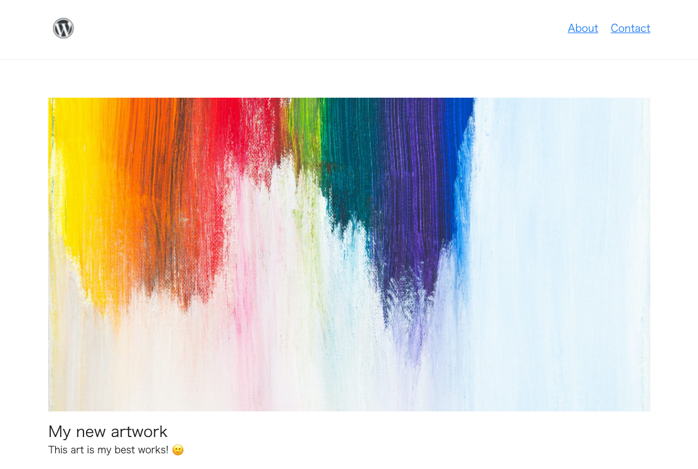

<h1 align="center">
<p align="center">WWR - WordPress theme with React, Typescript, SWR and WP API.</p>

</h1>

## Introduction
WWRはReact、Typescript、SWR、WP APIを使用してデザインを構築できる、ハイパフォーマンスなWordPressテーマです。
  
WordPressテーマでデフォルトで設定されているCSSおよびJavascriptファイルの読み込みや不要なメタタグをすべて取り除くことでよりシンプルかつ高速な動作を実現しています。
  
また、フロントエンドコードの最小化するためのコード分割、遅延読み込みにも対応しています。

## Get Started
```bash
$ cd /path/to/wwr # Theme folder

# package install
$ yarn install

# development
$ yarn dev
```

## セットアップ (Backend)

### env.php

#### 環境の切り替え

```php
const ENV = "development"; // or "production"
```

開発環境と本番環境を切り替えます。  
`ENV`の値によって、読み込むフロントエンドコードも自動的に切り替えます。

#### APIエンドポイント

```php
const API_ENDPOINT = "wp/v2";
```

フロントエンドコードから参照するAPIエンドポイントを定義します。  
デフォルトではWordPressの初期設定を適用しています。

#### メール設定

```php
define("MAIL_TO", "to@example.com");
...
define("SMTP_DEBUG", 0);
```

メールのSMTP設定を定義します。  
`ENV`が`"development"`の場合、[maildev](https://github.com/maildev/maildev)を使用してローカルでのメール送信テストを行うことができます。  
`yarn dev`コマンドでmaildevも自動的に起動するため、ローカルでのメール送信テストでは`yarn dev`を実行する必要があります。  
`yarn dev`実行中は`localhost:1080`でmaildevアプリケーションを起動することができます。

### functions.php

#### API

```php
function add_api_endpoint(): void {
  register_rest_route(
    API_ENDPOINT,
    "/contact",
    array(
      "methods" => "POST",
      "callback" => "send_contact"
    )
  );
  register_rest_route(
    API_ENDPOINT,
    "<your custom endpoint>",
    array(
      "methods" => "GET", // "POST", "PUT", "PATCH" and more
      "callback" => "your_custom_callback_function" // your callback function name
    )
  );
}

your_custom_callback_function(WP_REST_Request $request) {
  // write your callback function
  return new WP_REST_Response($data, 200);
}
```

カスタムAPIエンドポイントを作成します。  
エンドポイントURLとリクエストメソッド、コールバック関数を定義して`register_rest_route`で登録します。  
コールバック関数には`WP_REST_Request`を引数にとり、`WP_REST_Response`を返却する必要があります。


### templates/config.php

```php
<script src="react-on-php-config">
  window.config = {
    "siteTitle": "<?php bloginfo("name") ?>",
    "siteDescription": "<?php bloginfo("description") ?>",
    "appId": "",
    "buildId": "",
    "api": "<?php echo "/wp-json" . "/" . API_ENDPOINT ?>",
    "staticUri": "<?php echo get_template_directory_uri() . "/static" ?>"
    // ... your custom config
  }
</script>
```

config.php内でフロントエンドコードへデータを渡すことができます。  
config.php内のデータの型は`src/global.d.ts`内で定義され、`src/hooks/use-site-config`で初期化しています。  
デフォルトのconfigに追加してデータを渡す場合は、この両方のファイルを更新する必要があります。

## セットアップ (Frontend)
フロントエンドコードでは`src/main.ts`内の`main()`のみ実行されます。  
また、グローバルなCSSは`src/main.scss`に記述します。
  
フロントエンドでは[React](https://github.com/facebook/react), [React Router](https://github.com/remix-run/react-router), [React Helmet](https://github.com/nfl/react-helmet),  [SWR](https://github.com/vercel/swr), [axios](https://github.com/axios/axios)のみインストール、設定をしています。
  
上記のパッケージ含め、必要なライブラリを自由に使用することができます。  


## Build

```bash
$ yarn build
```

ビルドしたフロントエンドコードは`release`ディレクトリに吐き出されます。  
用意したサーバーやクラウドに、通常のWordPressデプロイと同じフローで構築してください。  
  
phpから`release`ディレクトリを参照するには`env.php`内の`ENV`を`"production"`に書き換えること必要があります。  
  
  